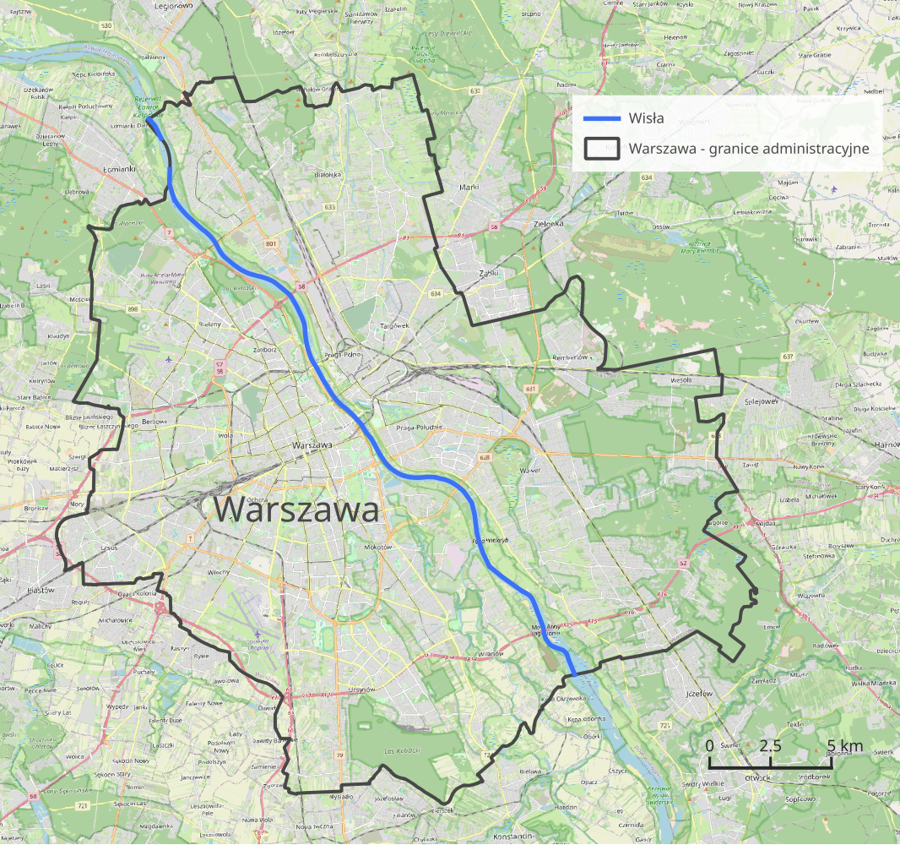
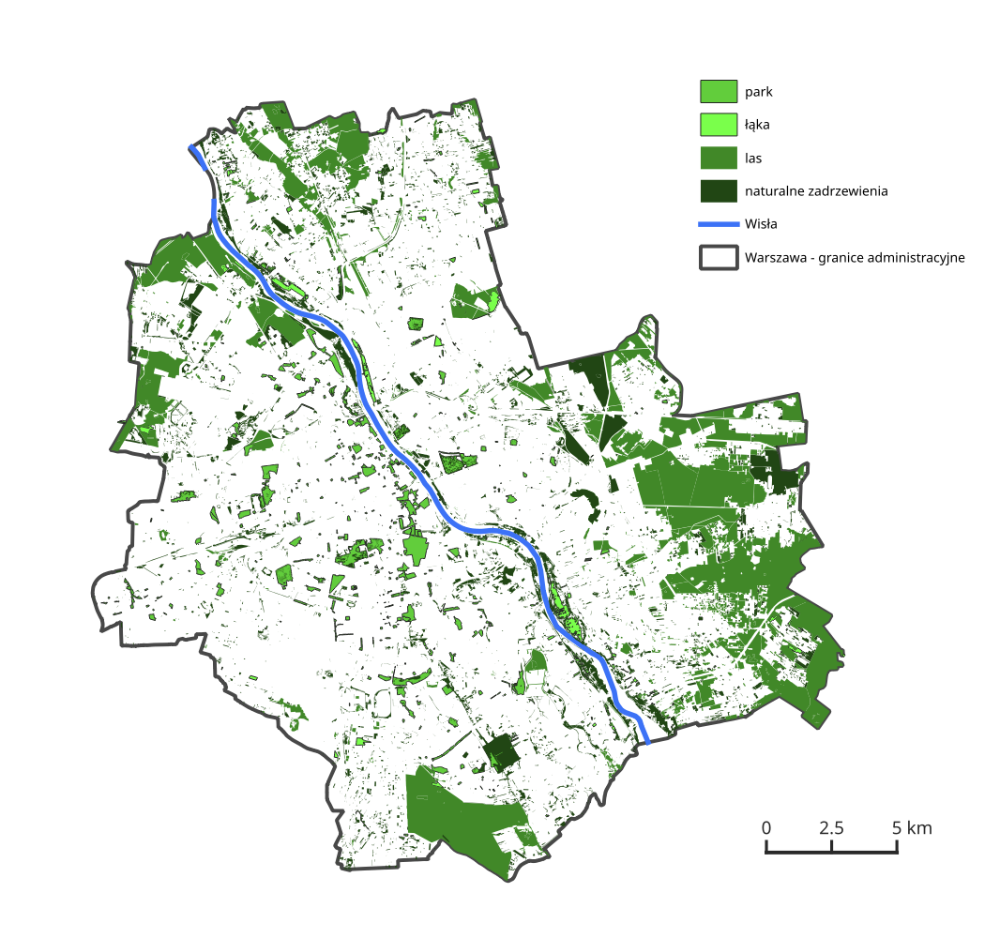
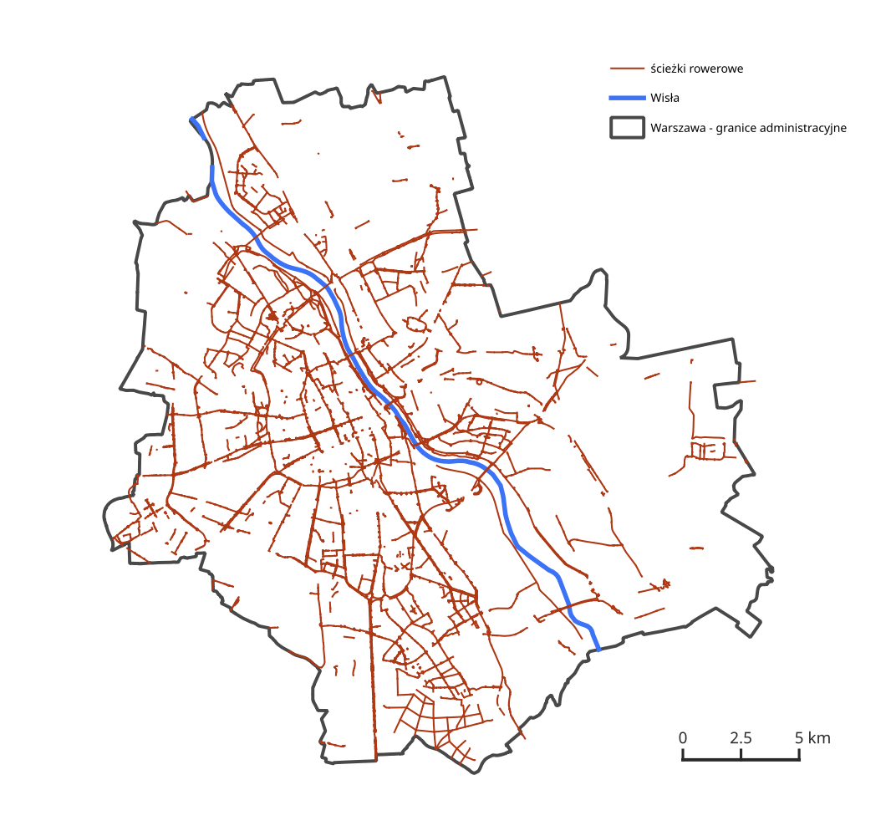
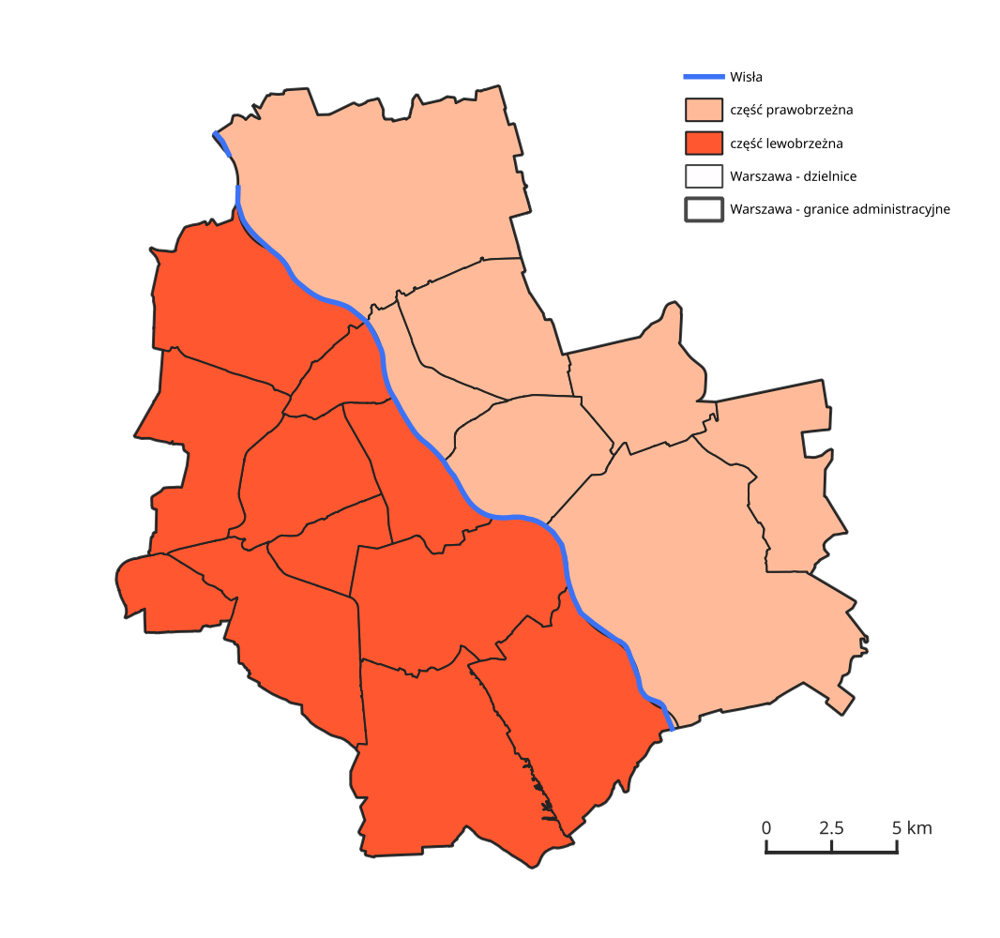
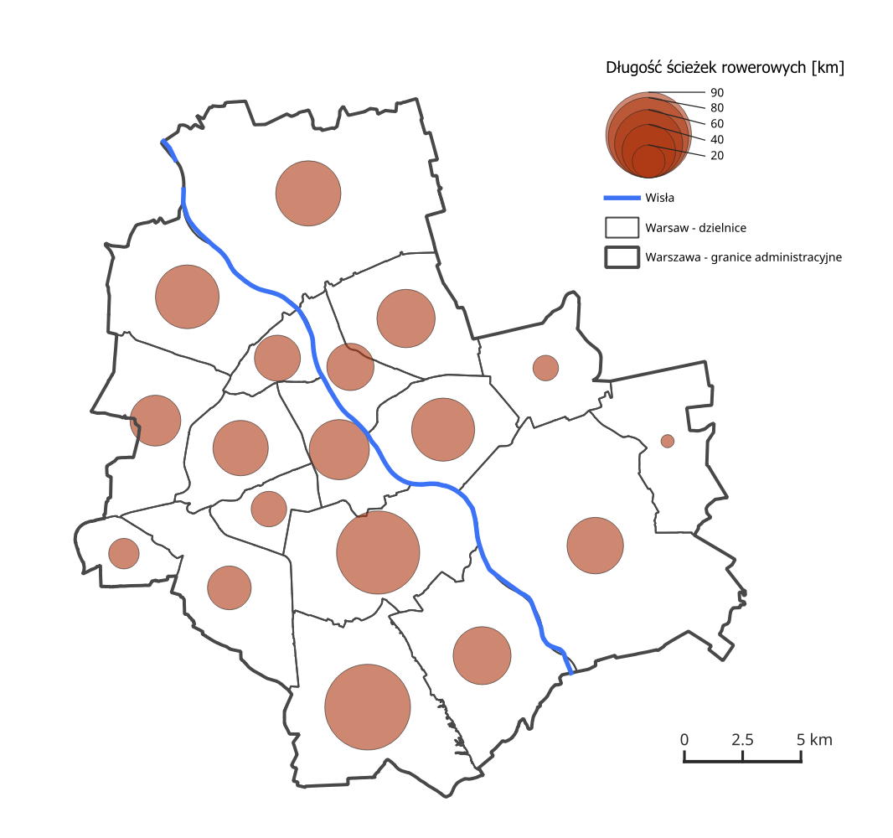
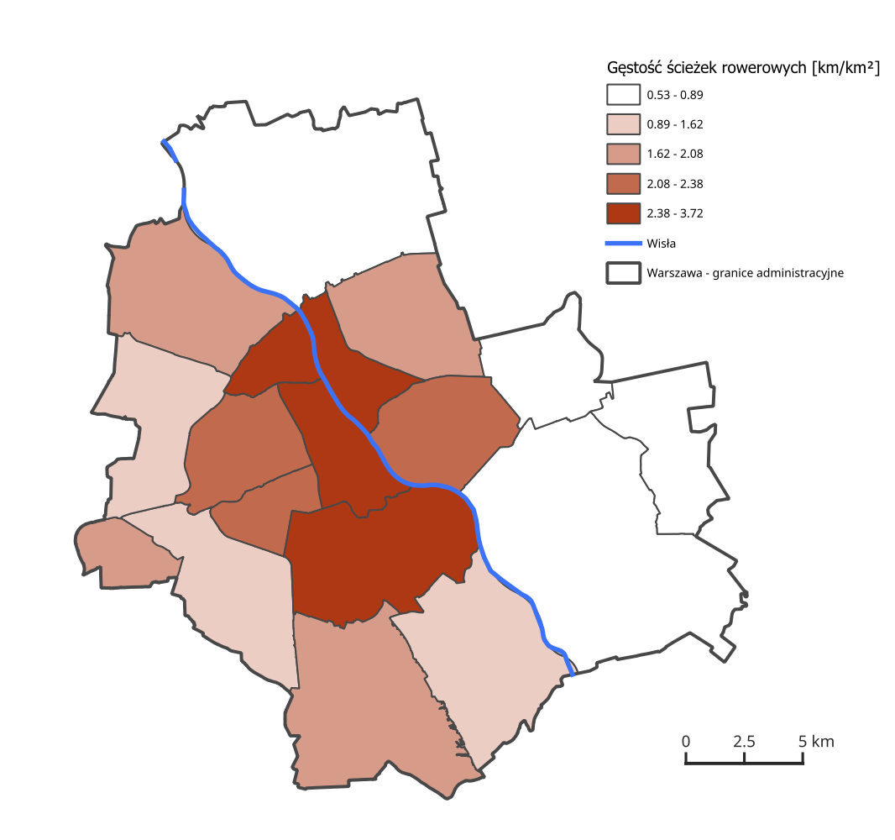

# Dostępność zieleni miejskiej w kontekście infrastruktury rowerowej
## Analiza przestrzenna miasta Warszawy na poziomie dzielnic

_Zastrzeżenie: projekt tworzony w celach edukacyjnych, służący wykorzystaniu w praktyce zdobytej przeze mnie wiedzy o podstawowej obsłudze systemów GIS oraz obróbce, podstawowych operacjach i analizie danych przestrzennych._

## Opis projektu
Projekt prezentuje podstawowe informacje oraz wyniki analiz danych przestrzennych dotyczących miasta Warszawy w kontekście infrastruktury rowerowej oraz terenów zielonych (parków, łąk, lasów i naturalnych zadrzewień). Analiza uwzględnia podział miasta na poszczególne dzielnice.

Na potrzeby analizy uwzględniłem wyłącznie liniowe elementy infrastruktury rowerowej, obejmujące drogi i ciągi komunikacyjne dostępne dla ruchu rowerowego, bez uwzględnienia obiektów punktowych, takich jak parkingi czy stojaki rowerowe.

## Warszawa
Poniższa mapa (Rysunek 1) przedstawia obszar Warszawy wraz z granicami administracyjnymi miasta oraz przebiegiem rzeki Wisły przez jego obszar.

 

   
  <em>Rysunek 1. Granice administracyjne miasta Warszawy oraz rzeka Wisła</em>

 

W tabeli (Tabela 1) przedstawiem powierzchnię miasta oraz powierzchnie analizowanych obszarów zielonych (parków, łąk, lasów i naturalnych zadrzewień), a także łączną długość ścieżek rowerowych na terenie Warszawy.

 

<em>Tabela 1. Powierzchnie miasta Warszawy oraz analizowanych obszarów zielonych </em>
  <table border="1">
    <tr>
      <td><b>Całkowita powierzchnia</b></td>
      <td></td>
    </tr>
    <tr>
      <td> miasta</td>
      <td>517,2 km2</td>
    </tr>
    <tr>
      <td> parków</td>
      <td>12,4 km2</td>
    </tr>
    <tr>
      <td> łąk</td>
      <td>3,5 km2</td>
    </tr>
    <tr>
      <td> lasów</td>
      <td>75,7 km2</td>
    </tr>
    <tr>
      <td> zadrzewień</td>
      <td>33,9 km2</td>
    </tr>
    <tr>
      <td><b>Łączna długość</b></td>
      <td></td>
    </tr>
    <tr>
      <td> ścieżek rowerowych</td>
      <td>761,2 km</td>
    </tr>
  </table>

 

Poniższe mapy (Rysunek 2, Rysunek 3) przedstawiają rozmieszczenie terenów zielonych z podziałem na analizowane kategorie oraz przebieg infrastruktury rowerowej w granicach administracyjnych Warszawy.

 

   
  <em>Rysunek 2. Tereny zielone na obszarze Warszawy</em>

 

   
  <em>Rysunek 3. Infrastruktura rowerowa na obszarze Warszawy</em>

 

Rzeka Wisła dzieli Warszawę na część lewobrzeżną (zachodnią) oraz prawobrzeżną (wschodnią) (Tabela 2, Rysunek 4).

 

<em>Tabela 2. Powierzchnie miasta Warszawy oraz analizowanych obszarów zielonych w podziale na część lewobrzeżną i prawobrzeżną</em>
  <table border="1">
    <tr>
      <th></th>
      <th>Część lewobrzeżna</th>
    <th>Część prawobrzeżna</th>
    </tr>
    <tr>
      <td><b>Całkowita powierzchnia</b></td>
      <td></td>
      <td></td>
    </tr>
    <tr>
      <td> miasta</td>
      <td>264,5 km2</td>
      <td>252,7 km2</td>
    </tr>
    <tr>
      <td> parków</td>
      <td>10,5 km2</td>
      <td>1,9 km2</td>
    </tr>
    <tr>
      <td> łąk</td>
      <td>0,9 km2</td>
      <td>2,6 km2</td>
    </tr>
    <tr>
      <td> lasów</td>
      <td>22,6 km2</td>
      <td>53,1 km2</td>
    </tr>
    <tr>
      <td> zadrzewień</td>
      <td>15,1 km2</td>
      <td>18,8 km2</td>
    </tr>
    <tr>
      <td><b>Łączna długość</b></td>
      <td></td>
    <td></td>
    </tr>
    <tr>
      <td> ścieżek rowerowych</td>
      <td>502,8 km</td>
      <td>258,4 km</td>
    </tr>
  </table>

 

Podział miasta przez rzekę Wisłę wpływa na strukturę zagospodarowania przestrzennego. Część prawobrzeżna Warszawy charakteryzuje się większym udziałem lasów i terenów półnaturalnych, natomiast część lewobrzeżna cechuje się bardziej rozwiniętą infrastrukturą rowerową oraz większym udziałem parków miejskich.

   
  <em>Rysunek 4. Podział powierzchni Warszawy na część lewobrzeżną oraz prawobrzeżną</em>

 

## Dzielnice Warszawy
Warszawa podzielona jest na 18 dzielnic. Ich powierzchnie zestawiem w poniższej tabeli (Tabela 3), natomiast podział administracyjny przedstawiłem na poniższej mapie (Rysunek 5).

 

<em>Tabela 3. Powierzchnie poszczególnych dzielnic miasta Warszawy </em>
  <table border="1">
    <tr>
      <th>Dzielnica</th>
      <th>Powierzchnia</th>
    </tr>
    <tr>
      <td>Wawer</td>
      <td>79,7 km²</td>
    </tr>
    <tr>
      <td>Białołęka</td>
      <td>73,0 km²</td>
    </tr>
    <tr>
      <td>Ursynów</td>
      <td>43,8 km²</td>
    </tr>
    <tr>
      <td>Wilanów</td>
      <td>36,7 km²</td>
    </tr>
    <tr>
      <td>Mokotów</td>
      <td>35,4 km²</td>
    </tr>
    <tr>
      <td>Bielany</td>
      <td>32,3 km²</td>
    </tr>
    <tr>
      <td>Włochy</td>
      <td>28,6 km²</td>
    </tr>
    <tr>
      <td>Bemowo</td>
      <td>25,0 km²</td>
    </tr>
    <tr>
      <td>Targówek</td>
      <td>24,3 km²</td>
    </tr>
    <tr>
      <td>Wesoła</td>
      <td>22,9 km²</td>
    </tr>
    <tr>
      <td>Praga-Południe</td>
      <td>22,4 km²</td>
    </tr>
    <tr>
      <td>Rembertów</td>
      <td>19,3 km²</td>
    </tr>
    <tr>
      <td>Wola</td>
      <td>19,3 km²</td>
    </tr>
    <tr>
      <td>Śródmieście</td>
      <td>15,6 km²</td>
    </tr>
    <tr>
      <td>Praga-Północ</td>
      <td>11,3 km²</td>
    </tr>
    <tr>
      <td>Ochota</td>
      <td>9,7 km²</td>
    </tr>
    <tr>
      <td>Ursus</td>
      <td>9,4 km²</td>
    </tr>
    <tr>
      <td>Żoliborz</td>
      <td>8,5 km²</td>
    </tr>
  </table>

 

   
  <em>Rysunek 5. Podział administracyjny powierzchni Warszawy na dzielnice</em>

 

## Ścieżki rowerowe

W poniższej tabeli (Tabela 4) przedstawiłem długości oraz gęstość infrastruktury rowerowej w podziale na poszczególne dzielnice Warszawy.

 

<em>Tabela 4. Długość oraz gęstość tras rowerowych w podziale na poszczególne dzielnice Warszawy</em>
  <table border="1">
    <tr>
      <th>Dzielnica</th>
      <th>Długość ścieżek rowerowych</th>
      <th>Gęstość ścieżek rowerowych</th>
    </tr>
    <tr>
      <td>Ursynów</td>
      <td>90,0 km</td>
      <td>2,1 km/km²</td>
    </tr>
    <tr>
      <td>Mokotów</td>
      <td>85,3 km</td>
      <td>2,4 km/km²</td>
    </tr>
    <tr>
      <td>Białołęka</td>
      <td>55,7 km</td>
      <td>0,8 km/km²</td>
    </tr>
    <tr>
      <td>Bielany</td>
      <td>53,5 km</td>
      <td>1,7 km/km²</td>
    </tr>
    <tr>
      <td>Praga-Południe</td>
      <td>52,6 km</td>
      <td>2,4 km/km²</td>
    </tr>
    <tr>
      <td>Śródmieście</td>
      <td>48,5 km</td>
      <td>3,1 km/km²</td>
    </tr>
    <tr>
      <td>Targówek</td>
      <td>46,0 km</td>
      <td>1,9 km/km²</td>
    </tr>
    <tr>
      <td>Wilanów</td>
      <td>45,6 km</td>
      <td>1,2 km/km²</td>
    </tr>
    <tr>
      <td>Wawer</td>
      <td>43,6 km</td>
      <td>0,5 km/km²</td>
    </tr>
    <tr>
      <td>Wola</td>
      <td>42,2 km</td>
      <td>2,2 km/km²</td>
    </tr>
    <tr>
      <td>Bemowo</td>
      <td>36,8 km</td>
      <td>1,5 km/km²</td>
    </tr>
    <tr>
      <td>Praga-Północ</td>
      <td>32,8 km</td>
      <td>2,9 km/km²</td>
    </tr>
    <tr>
      <td>Żoliborz</td>
      <td>31,5 km</td>
      <td>3,7 km/km²</td>
    </tr>
    <tr>
      <td>Włochy</td>
      <td>29,2 km</td>
      <td>1,0 km/km²</td>
    </tr>
    <tr>
      <td>Ochota</td>
      <td>21,9 km</td>
      <td>2,3 km/km²</td>
    </tr>
    <tr>
      <td>Ursus</td>
      <td>18,4 km</td>
      <td>2,0 km/km²</td>
    </tr>
    <tr>
      <td>Rembertów</td>
      <td>15,6 km</td>
      <td>0,8 km/km²</td>
    </tr>
    <tr>
      <td>Wesoła</td>
      <td>12,1 km</td>
      <td>0,5 km/km²</td>
    </tr>
  </table>

 

Poniższe mapy (Rysunek 6, Rysunek 7) przedstawiają łączną długość infrastruktury rowerowej oraz jej gęstość w podziale na poszczególne dzielnice Warszawy.

 

   
  <em>Rysunek 6. Długości tras rowerowych w podziale na poszczególne dzielnice Warszawy</em>

 

   
  <em>Rysunek 7. Gęstość tras rowerowych w podziale na poszczególne dzielnice Warszawy</em>

Widoczna jest wyraźna koncentracja infrastruktury rowerowej w centralnych oraz gęściej zabudowanych dzielnicach miasta. Najwyższe wartości gęstości ścieżek rowerowych występują m.in. w Śródmieściu, Żoliborzu oraz na Pradze-Północ, co wynika z intensywnej urbanizacji tych obszarów oraz większego zapotrzebowania na alternatywne formy transportu. Z kolei dzielnice peryferyjne, takie jak Wawer, Wesoła czy Białołęka, mimo dużej powierzchni, charakteryzują się niższą gęstością infrastruktury rowerowej.

## Tereny zielone

W poniższej tabeli (Tabela 5) wyszczególniłem powierzchnie poszczególnych kategorii terenów zielonych w poszczególnych dzielnicach Warszawy.

 

<em>Tabela 5. Powierzchnie poszczególnych kategorii terenów zielonych w dzielnicach Warszawy</em>
  <table border="1">
    <tr>
      <th>Dzielnica</th>
      <th>Powierzchnia</th>
      <th>Parki</th>
      <th>Łąki</th>
      <th>Lasy</th>
      <th>Naturalne zadrzewienia</th>
      <th>Sumaryczna powierzchnia terenów zielonych</th>
    </tr>
    <tr>
      <td>Wawer</td>
      <td>79,71 km²</td>
      <td>0,08 km²</td>
      <td>1,13 km²</td>
      <td>25,00 km²</td>
      <td>5,11 km²</td>
      <td>31,32 km²</td>
    </tr>
    <tr>
      <td>Białołęka</td>
      <td>73,00 km²</td>
      <td>0,30 km²</td>
      <td>0,73 km²</td>
      <td>9,62 km²</td>
      <td>5,24 km²</td>
      <td>15,89 km²</td>
    </tr>
    <tr>
      <td>Ursynów</td>
      <td>43,79 km²</td>
      <td>0,79 km²</td>
      <td>0,18 km²</td>
      <td>9,90 km²</td>
      <td>1,87 km²</td>
      <td>12,74 km²</td>
    </tr>
    <tr>
      <td>Wilanów</td>
      <td>36,73 km²</td>
      <td>1,46 km²</td>
      <td>0,27 km²</td>
      <td>0,95 km²</td>
      <td>4,07 km²</td>
      <td>6,75 km²</td>
    </tr>
    <tr>
      <td>Mokotów</td>
      <td>35,42 km²</td>
      <td>1,75 km²</td>
      <td>0,12 km²</td>
      <td>0,15 km²</td>
      <td>2,29 km²</td>
      <td>4,31 km²</td>
    </tr>
    <tr>
      <td>Bielany</td>
      <td>32,34 km²</td>
      <td>0,37 km²</td>
      <td>0,13 km²</td>
      <td>7,58 km²</td>
      <td>2,54 km²</td>
      <td>10,62 km²</td>
    </tr>
    <tr>
      <td>Włochy</td>
      <td>28,63 km²</td>
      <td>0,24 km²</td>
      <td>0,06 km²</td>
      <td>0,42 km²</td>
      <td>0,56 km²</td>
      <td>1,28 km²</td>
    </tr>
    <tr>
      <td>Bemowo</td>
      <td>24,95 km²</td>
      <td>0,44 km²</td>
      <td>0,10 km²</td>
      <td>2,77 km²</td>
      <td>1,53 km²</td>
      <td>4,84 km²</td>
    </tr>
    <tr>
      <td>Targówek</td>
      <td>24,33 km²</td>
      <td>0,34 km²</td>
      <td>0,35 km²</td>
      <td>2,03 km²</td>
      <td>0,87 km²</td>
      <td>3,59 km²</td>
    </tr>
    <tr>
      <td>Wesoła</td>
      <td>22,94 km²</td>
      <td>0,01 km²</td>
      <td>0,02 km²</td>
      <td>10,70 km²</td>
      <td>2,39 km²</td>
      <td>13,11 km²</td>
    </tr>
    <tr>
      <td>Praga-Południe</td>
      <td>22,38 km²</td>
      <td>0,91 km²</td>
      <td>0,02 km²</td>
      <td>0,12 km²</td>
      <td>1,76 km²</td>
      <td>2,82 km²</td>
    </tr>
    <tr>
      <td>Rembertów</td>
      <td>19,30 km²</td>
      <td>0,04 km²</td>
      <td>0,00 km²</td>
      <td>5,50 km²</td>
      <td>2,73 km²</td>
      <td>8,26 km²</td>
    </tr>
    <tr>
      <td>Wola</td>
      <td>19,26 km²</td>
      <td>0,87 km²</td>
      <td>0,00 km²</td>
      <td>0,59 km²</td>
      <td>0,77 km²</td>
      <td>2,23 km²</td>
    </tr>
    <tr>
      <td>Śródmieście</td>
      <td>15,57 km²</td>
      <td>2,61 km²</td>
      <td>0,00 km²</td>
      <td>0,09 km²</td>
      <td>0,26 km²</td>
      <td>2,96 km²</td>
    </tr>
    <tr>
      <td>Praga-Północ</td>
      <td>11,31 km²</td>
      <td>0,23 km²</td>
      <td>0,36 km²</td>
      <td>0,12 km²</td>
      <td>0,71 km²</td>
      <td>1,41 km²</td>
    </tr>
    <tr>
      <td>Ochota</td>
      <td>9,72 km²</td>
      <td>1,17 km²</td>
      <td>0,00 km²</td>
      <td>0,11 km²</td>
      <td>0,35 km²</td>
      <td>1,64 km²</td>
    </tr>
    <tr>
      <td>Ursus</td>
      <td>9,35 km²</td>
      <td>0,22 km²</td>
      <td>0,00 km²</td>
      <td>0,01 km²</td>
      <td>0,12 km²</td>
      <td>0,34 km²</td>
    </tr>
    <tr>
      <td>Żoliborz</td>
      <td>8,47 km²</td>
      <td>0,62 km²</td>
      <td>0,00 km²</td>
      <td>0,02 km²</td>
      <td>0,74 km²</td>
      <td>1,38 km²</td>
    </tr>
  </table>

 

W kolejnej tabeli (Tabela 6) przedstawiłem procentowy udział poszczególnych kategorii terenów zielonych w powierzchni poszczególnych dzielnic Warszawy.

 

<em>Tabela 6. Procentowy udział poszczególnych kategorii terenów zielonych w dzielnicach Warszawy</em>
  <table border="1">
    <tr>
      <th>Dzielnica</th>
      <th>Parki</th>
      <th>Łąki</th>
      <th>Lasy</th>
      <th>Naturalne zadrzewienia</th>
      <th>Sumaryczny % powierzchni terenów zielonych</th>
    </tr>
    <tr>
      <td>Bielany</td>
      <td>1,1%</td>
      <td>0,4%</td>
      <td>23,4%</td>
      <td>7,9%</td>
      <td>32,8%</td>
    </tr>
    <tr>
      <td>Włochy</td>
      <td>0,8%</td>
      <td>0,2%</td>
      <td>1,5%</td>
      <td>2,0%</td>
      <td>4,5%</td>
    </tr>
    <tr>
      <td>Białołęka</td>
      <td>0,4%</td>
      <td>1,0%</td>
      <td>13,2%</td>
      <td>7,2%</td>
      <td>21,8%</td>
    </tr>
    <tr>
      <td>Wola</td>
      <td>4,5%</td>
      <td>0,0%</td>
      <td>3,1%</td>
      <td>4,0%</td>
      <td>11,6%</td>
    </tr>
    <tr>
      <td>Ochota</td>
      <td>12,0%</td>
      <td>0,0%</td>
      <td>1,2%</td>
      <td>3,6%</td>
      <td>16,8%</td>
    </tr>
    <tr>
      <td>Żoliborz</td>
      <td>7,3%</td>
      <td>0,0%</td>
      <td>0,2%</td>
      <td>8,7%</td>
      <td>16,3%</td>
    </tr>
    <tr>
      <td>Śródmieście</td>
      <td>16,7%</td>
      <td>0,0%</td>
      <td>0,6%</td>
      <td>1,6%</td>
      <td>19,0%</td>
    </tr>
    <tr>
      <td>Mokotów</td>
      <td>4,9%</td>
      <td>0,3%</td>
      <td>0,4%</td>
      <td>6,5%</td>
      <td>12,2%</td>
    </tr>
    <tr>
      <td>Ursynów</td>
      <td>1,8%</td>
      <td>0,4%</td>
      <td>22,6%</td>
      <td>4,3%</td>
      <td>29,1%</td>
    </tr>
    <tr>
      <td>Praga-Północ</td>
      <td>2,0%</td>
      <td>3,1%</td>
      <td>1,0%</td>
      <td>6,2%</td>
      <td>12,4%</td>
    </tr>
    <tr>
      <td>Targówek</td>
      <td>1,4%</td>
      <td>1,5%</td>
      <td>8,4%</td>
      <td>3,6%</td>
      <td>14,8%</td>
    </tr>
    <tr>
      <td>Praga-Południe</td>
      <td>4,1%</td>
      <td>0,1%</td>
      <td>0,5%</td>
      <td>7,9%</td>
      <td>12,6%</td>
    </tr>
    <tr>
      <td>Wilanów</td>
      <td>4,0%</td>
      <td>0,7%</td>
      <td>2,6%</td>
      <td>11,1%</td>
      <td>18,4%</td>
    </tr>
    <tr>
      <td>Wawer</td>
      <td>0,1%</td>
      <td>1,4%</td>
      <td>31,4%</td>
      <td>6,4%</td>
      <td>39,3%</td>
    </tr>
    <tr>
      <td>Rembertów</td>
      <td>0,2%</td>
      <td>0,0%</td>
      <td>28,5%</td>
      <td>14,1%</td>
      <td>42,8%</td>
    </tr>
    <tr>
      <td>Wesoła</td>
      <td>0,0%</td>
      <td>0,1%</td>
      <td>46,6%</td>
      <td>10,4%</td>
      <td>57,1%</td>
    </tr>
    <tr>
      <td>Ursus</td>
      <td>2,3%</td>
      <td>0,0%</td>
      <td>0,1%</td>
      <td>1,3%</td>
      <td>3,6%</td>
    </tr>
    <tr>
      <td>Bemowo</td>
      <td>1,8%</td>
      <td>0,4%</td>
      <td>11,1%</td>
      <td>6,1%</td>
      <td>19,4%</td>
    </tr>
  </table>

 

Analiza przestrzenna terenów zielonych wskazuje na odwrotną zależność w porównaniu do infrastruktury rowerowej. Najwyższy udział terenów zielonych występuje w dzielnicach o mniejszej intensywności zabudowy, takich jak Wesoła, Rembertów czy Wawer, gdzie dominującą formą zieleni są lasy oraz naturalne zadrzewienia. Dzielnice centralne i silnie zurbanizowane cechują się znacznie mniejszym udziałem terenów zielonych, przy czym istotną rolę odgrywają tam parki miejskie jako podstawowa forma zieleni urządzonej.

## Wnioski i interpretacja wyników

Przeprowadzona analiza danych przestrzennych pozwala na wskazanie istotnych zróżnicowań w rozmieszczeniu infrastruktury rowerowej oraz terenów zielonych na obszarze Warszawy.

Uzyskane wyniki potwierdzają silny związek pomiędzy stopniem urbanizacji dzielnic a dostępnością infrastruktury rowerowej oraz strukturą terenów zielonych. Analiza przestrzenna umożliwia identyfikację obszarów o potencjale do dalszego rozwoju infrastruktury rowerowej, szczególnie w dzielnicach o dużej powierzchni terenów zielonych i niskiej gęstości sieci rowerowej.

## Możliwe kierunki dalszych analiz
- analiza dostępności terenów zielonych
- korelacja gęstości zaludnienia z gęstością ścieżek rowerowych
- analiza ciągłości sieci rowerowej